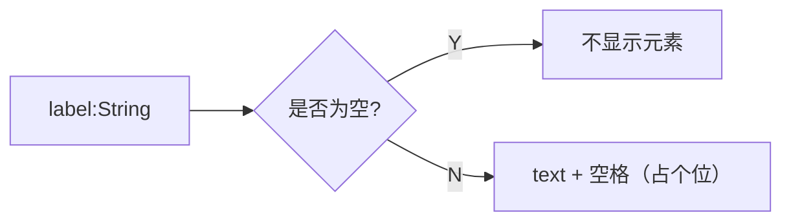

## 基于 element-ui 的表单

参考地址 http://element.eleme.io/1.3/#/zh-CN/component/form

### 需求

| 组件名称 | 组件路径 | 组件说明
| --- | --- | --- |
| nftn-el-input | /components/element-ui/input.vue | 根据类型不同有不同的展示 |
| nftn-el-form | /components/element-ui/main.vue | 带有 grid 布局的表单组件 |

### 依赖
| 组件名称 | 组件路径 | 组件说明
| --- | --- | --- |
| nftn-el-grid | /components/element-ui/grid.vue | 配置自适应网格布局 |

### 图例
```viz
    digraph G {
        "nftn-el-form" -> "nftn-el-grid" -> "nftn-el-input";
        "nftn-el-input" -> text;
        "nftn-el-input" -> select;
        "nftn-el-input" -> datetimepicker;
        "nftn-el-input" -> "...";
    }
```

### 计划
---
#### @/components/element-ui/grid/main.vue ___(20170621)___
##### _配置项_
- [x] `v-bind:grid => Object` 集成 grid 组件配置（按需创建 grid slots） ___(20170621√)___
- [x] `v-bind:action-grid => String` 表单操作位置 ___(20170622 ~ 20170626√)___
- [x] `v-bind:label-position => String(top, left, right)` 表单项标题位置 ___(20170622√)___
- [x] `v-bind:label-width => Number` 表单项标题宽度 ___(20170622√)___
- [x] `v-bind:inputs => Array` 表单项配置 ___(20170622√)___
```javascript
let input = {
    grid: String, // √
    label: String, // √
    name: String, // √
    datasource: Array, // √
    disabled: Boolean(false), // √
    rules: Array, // √
    rows: Number, // √
    min: Number, // √ // type='checkbox'
    max: Number, // √ // type='checkbox | select'
    multiple: Boolean(false), // type='select' √
    clearable: Boolean(true), // type='select' √
    // 特殊项，只在 form.vue 组件中进行处理
    cascade: Object // type='select' (20170628√)
};
```
- [x] `v-bind:rules` 集成 rules 组件 ___(20170622 ~ 20170626√)___
- [x] `v-model: Object` 集成 input 数据 ___(20170622√)___

___

##### _优化项_
- [x] 当 v-model 缺少数据时，自动补全 ___(20170622√)___

___

##### _分发项_
- [x] grid ___(20170626√)___
```html
<nftn-el-form>
    <template slot="grid-0-0">
        替换 grid-0-0 区域的内容，如果不存在这个区域，无效！
    </template>
<nftn-el-form>
```
- [x] label ___(20170626√)___
```html
<nftn-el-form>
    <template slot="inputname.label">
        替换 “inputname” 的label显示内容
    </template>
<nftn-el-form>
```
- [x] input ___(20170626√)___
```html
<nftn-el-form>
    <template slot="inputname.input">
        替换 “inputname” 的输入显示内容
    </template>
<nftn-el-form>
```
---
#### @/components/element-ui/grid/input.vue ___(20170621)___
- [x] `v-bind:form-data => Object` 整个表单的数据，用以数据联动扩展 ___(20170627√)___
- [x] `v-bind:label => String` ___(20170622√)___

- [x] `v-bind:type => String` ___(20170622√)___
- [x] `v-bind:name => String` ___(20170622√)___
- [x] `v-bind:rules` 表单验证规则 ___(20170622 ~ 20170626√)___
- [x] `v-bind:configs => Object` ___(20170622√)___
- [x] `v-bind:datasource => Array` ___(20170622√)___
    ```javascript
    // type="radio | checkbox | select"
    let datasource = [{
        name: String, // display label √
        value: String, // select value √
        disabled: Boolean(false) // is selectable? √
    }];
    ```
- [x] `v-model` ___(20170622√)___
- [x] `v-bind:disabled => Boolean(false)` ___(20170627√)___
- [x] 提供 label 的分发位置
- [x] 集成 input:text
    - [x] 基础模式   ___(20170621√)___
    - [ ] autocomplete 模式 ___(20170622 ~ ?)___
- [x] 集成 select
    - [x] 单选模式   ___(20170622 ~ 20170627√)___
    - [x] 多选模式`v-bind:multiple => Boolean(false)` ___(20170622 ~ 20170627√)___
    - [x] 多选数量限制 `v-bind:max => Number` ___(20170627√)___
    - [x] 选项可清除`v-bind:clearable => Boolean(true)`   ___(20170627√)___
    - [x] ~~自定义模版~~ ___(20170627 - !)___
    - [x] ~~分组~~ ___(20170627 - !)___

- [ ] 集成 datetimepicker ___(20170622 ~ ?)___
    - [ ] 日期模式   ___(20170622 ~ ?)___
    - [ ] 时间模式 ___(20170622 ~ ?)___
    - [ ] 日期+时间模式 ___(20170622 ~ ?)___
    - [ ] 日期范围模式 ___(20170622 ~ ?)___
    - [ ] 时间范围模式 ? ___(20170622 ~ ?)___
- [x] 集成 radio ___(20170622√)___
- [x] 集成 checkbox ___(20170622 ~ 20160627√)___
    - [x] `v-bind:min => Number` ___(20170627√)___
    - [x] `v-bind:max => Number` ___(20170627√)___
- [x] 集成 textarea ___(20170622 ~ 20170626√)___
    - [x] `v-bind:rows => Number` ___(20170626√)___
    - [x] ~~`v-bind:autosize => { minRows: Number, maxRows: Number }`~~ ___(20170626 - !)___
- [ ] 集成 upload ___(20170622 ~ ?)___
- [ ] 集成 switch ___(20170622 ~ ?)___
- [ ] 集成 slider ___(20170622 ~ ?)___
- [ ] 禁用依赖 `v-bind:disable-width => String,Array` ___(20170627 ~ ?)___
- [ ] 启用起来 `v-bind:enable-width => String,Array` ___(20170627 ~ ?)___
